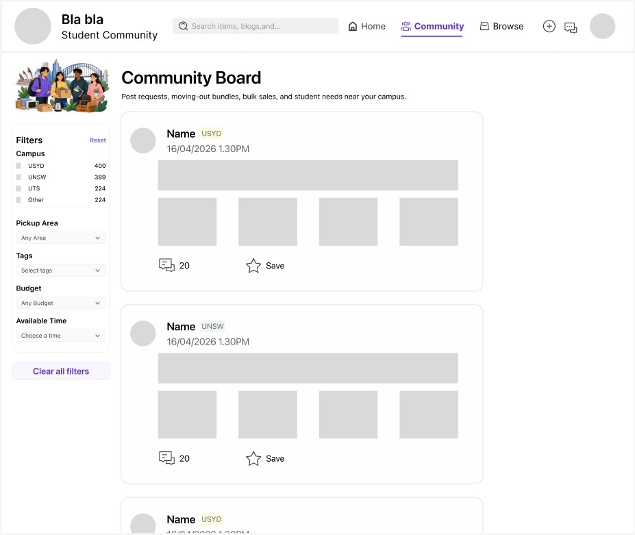
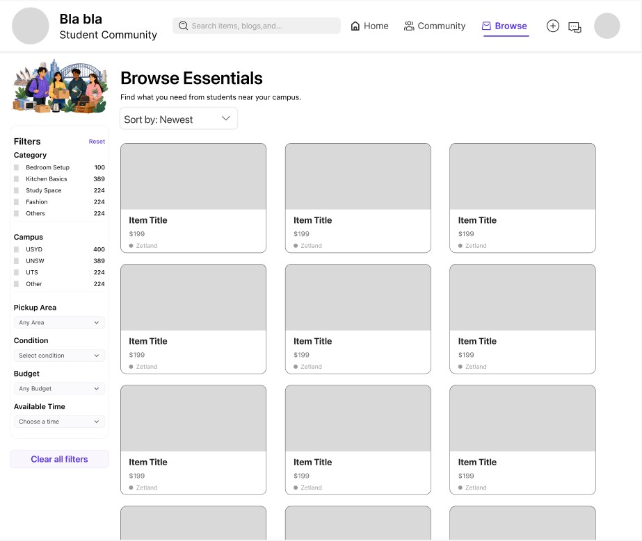
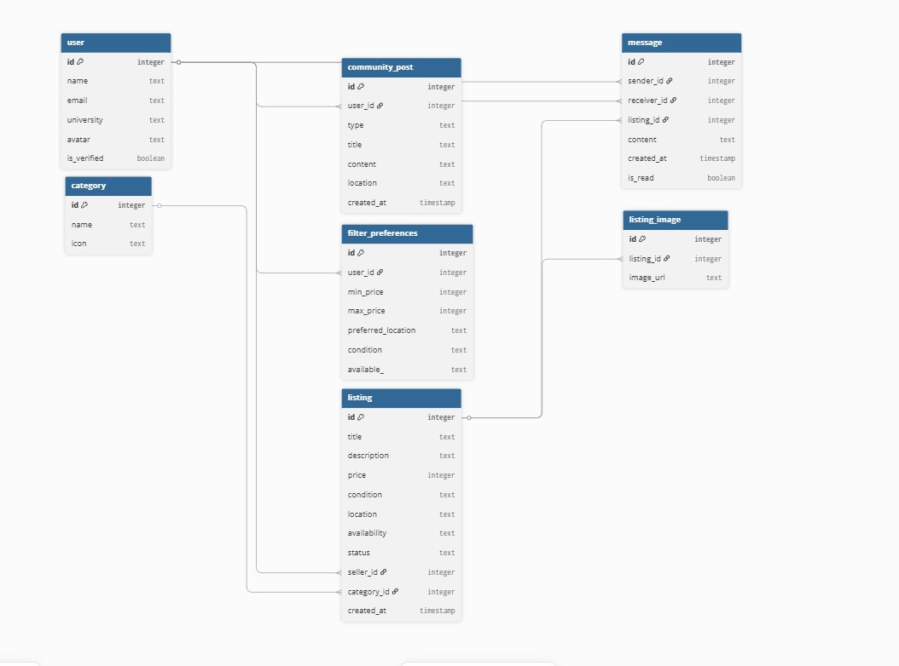

---
title: Week 8 - From Interfaces to Structured Information Systems
date: 2026-05-01
summary: Developing wireframes revealed that the platform depended on structured coordination systems rather than isolated marketplace pages.
tags: [wireframes, DBML, interaction design, data modelling, information architecture]
---

## Context

This week extends the earlier functional requirements into a more formal system design context. The wireframes were evaluated against the fixed implementation stack: MojoJS routing and server-side templates, SQLite persistence, HTMX interaction, Git-based development, and the unchanged BlaBla Corp prototype template. This helped keep the design realistic rather than proposing interactions that would require a different framework or a fully client-side application.

Building on Week 7's functional requirements, we developed wireframes and shifted focus from individual pages to interconnected systems, as even simple interactions required coordination between users, listings, and identity systems. Core requirements were prioritised around browsing, listing, and messaging, while advanced features such as recommendation systems were excluded due to MVP constraints.

## Wireframes and Design Decisions

The wireframes also introduced early accessibility and responsive design expectations. Independent pages are easier to test with keyboard navigation and screen readers than layered popups, especially when the interface is rendered through server-side templates. Mobile and desktop behaviour were considered through navigation density, card readability, form spacing, and tap target size.

Guided by last week's requirements, we created wireframes for core pages, leading to two key decisions. First, **simplifying page elements vs. retaining core functionality**: we removed complex features (e.g., algorithm recommendations) to prioritize intuitive browsing/communication for international students, avoiding prototype delays. Second, **independent messaging pages vs. embedded popups**: we chose independent pages to help users manage multiple conversations easily, aligning with their needs. 

## DDD, DBML, and Data Modeling

The data model created clear testing expectations. Listing creation should persist to SQLite, messages should be associated with the correct users and listings, and routes should obtain `user_id` and `username` from the session rather than from client-submitted values. It also highlighted a privacy requirement: users should only see conversations that involve their own account.

To translate wireframes to code, we used **DDD** to map core domains (User, Listing, Message), then **DBML** for data modeling. A third decision: **redundant fields vs. association efficiency** - we used foreign keys instead of redundant fields to ensure data consistency. We also identified the `Message` table as a junction entity between `User` and `Listing`. Additionally, we opted for asynchronous messaging to meet MVP timelines.

## Evaluation

We reserved detailed compliance/accessibility optimization for post-prototype. Wireframes include privacy/accessibility placeholders (hiding sensitive data, WCAG alignment) to ensure usability.

At this stage, evaluation criteria were defined rather than fully executed. The system should support WCAG 2.1 AA expectations, including clear labels, meaningful headings, visible focus states, and sufficient colour contrast. Performance was also considered through the requirement that pages should ideally load within one second and must remain below three seconds during prototype testing.

Cookie and privacy compliance were treated as system constraints. Because all users are assumed to be logged in, the session cookie is necessary for authentication. No analytics, advertising, or non-essential tracking should be introduced unless a consent mechanism is added.

## Reflection

This stage shifted me to **system-oriented design**. Wireframing revealed trade-offs, and DDD/DBML transformed the project into a coordination-focused system. Every decision balanced user needs, feasibility, maintainability, and testability, strengthening the prototype. The next implementation stage therefore needed to preserve this structure in MojoJS routes, SQLite tables, HTMX partials, and Git-tracked feature changes.

---

## Diagrams and System Artifacts

---

### Homepage Wireframe

This wireframe helped define how marketplace content would be prioritised and discovered by users.

---

### Community Page

The page exposed relationships between relocation needs, bundled offers, and community-based listings such as moving-out posts and bulk deals.

---

### Browse Essentials Page

The page supports users in applying precise filters to locate items that match their purchase needs.

---

### Product Upload Page

This wireframe clarified the structured information required for user-generated listings.

---

### Profile Page

The profile page highlights trust and identity through university verification badges.

---

### Messaging Page

The messaging interface exposed the complexity of supporting user-to-user communication around specific products.

---

### ERDs

