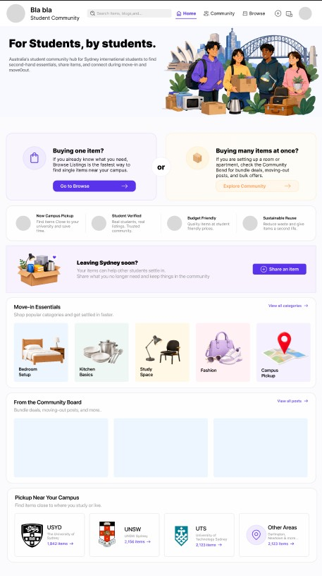
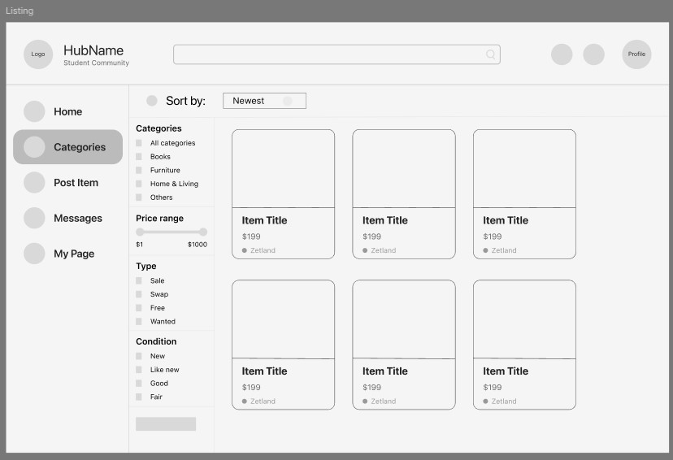
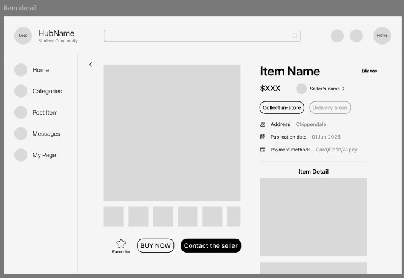
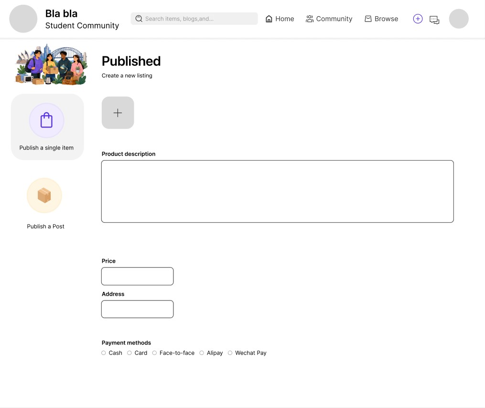
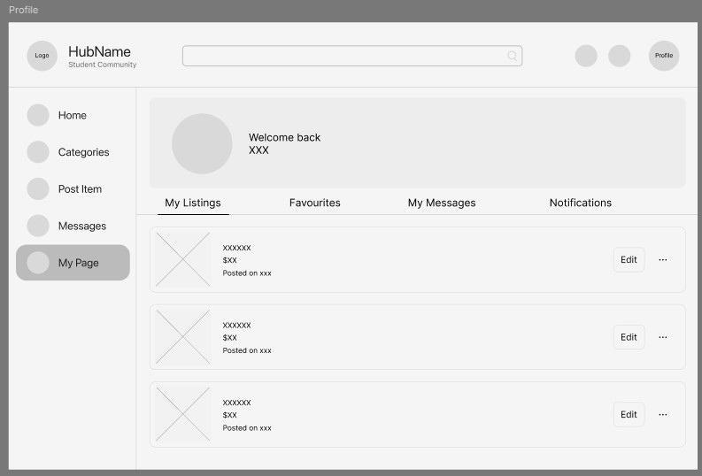
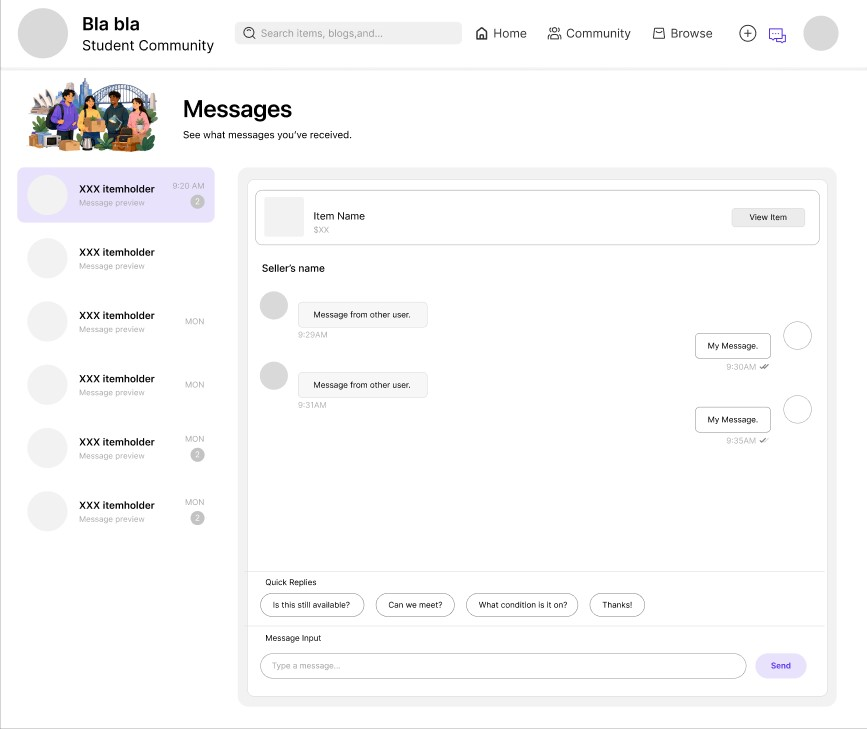
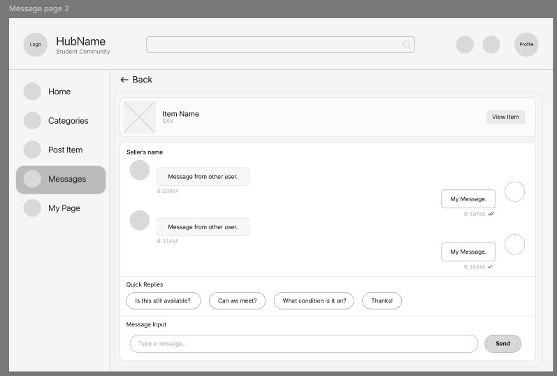

## Context

At this stage of the project, the team began translating early user needs into more concrete interface structures. Based on the needs of Sydney student users within second-hand marketplace scenarios, the application was divided into several key sections, including the homepage, category filtering page, item detail page, product upload page, profile page, login page, and direct messaging interface.

Creating these wireframes helped clarify how users would navigate the platform and interact with marketplace content. However, the process also revealed that many seemingly simple interactions depended on underlying system logic and structured relational data.

---

## From Interface Ideas to System Thinking

Developing wireframes shifted the project from interface-focused thinking toward understanding the application as a connected system. Each screen introduced new interaction requirements that required backend support and data relationships.

For example, the product detail page revealed the need to connect listing information with seller identity, item availability, and category data. The messaging page introduced user-to-user relationships and highlighted the complexity of supporting communication around specific products.

Similarly, the category filtering interface exposed the need for structured metadata and searchable categorisation systems. These interactions demonstrated that the interface could not function independently from the underlying information architecture.

---

## Identifying Data Requirements

The wireframes exposed several hidden data requirements that were necessary to support marketplace interactions.

| Interface Element | Required Data |
|---|---|
| Homepage | featured listings, categories, timestamps |
| Category filter page | tags, categories, keywords |
| Item detail page | item description, seller ID, availability |
| Product upload page | images, price, condition, category |
| Profile page | user information, listing history |
| Messaging page | sender ID, receiver ID, timestamps |

Through this process, the project evolved from interface-focused thinking toward understanding how user interactions depend on structured information architecture and system relationships.

---

## Using DDD and DBML

As the project became more structurally complex, the team began exploring Domain-Driven Design (DDD) and DBML to better understand the system architecture behind the interface.

This became particularly important because the project was developed collaboratively. Without a shared understanding of entities, relationships, and database structure, later development stages would become difficult to coordinate consistently across team members.

The DDD process helped identify the platform’s core entities, including:

- User
- Product
- Category
- Message

These entities represented the primary interactions within the marketplace ecosystem.

DBML was then used to visualise how these entities related to one another within the database structure.

```dbml
Table user {
  id integer [pk, increment]
  name text
  email text
  university text
  avatar text
}

Table category {
  id integer [pk, increment]
  name text
}

Table product {
  id integer [pk, increment]
  title text
  price integer
  description text
  seller_id integer [ref: > user.id]
  category_id integer [ref: > category.id]
  status text
}

Table message {
  id integer [pk, increment]
  sender_id integer [ref: > user.id]
  receiver_id integer [ref: > user.id]
  product_id integer [ref: > product.id]
  content text
}
```

The database structure also revealed how information dependencies shape the user experience.

| Entity Relationship | Design Implication |
|---|---|
| Product → User | Each listing requires ownership and seller identity |
| Product → Category | Filtering and browsing rely on structured categorisation |
| Message → Product | Conversations are contextualised around specific listings |
| Message → User | Communication requires sender and receiver tracking |

This process demonstrated that interaction design decisions directly influenced backend structure and database complexity.

---

## Trade-offs and Scope Decisions

During system modelling, the messaging feature emerged as one of the more technically complex components of the platform. While direct communication supports trust and negotiation within second-hand marketplaces, implementing a scalable real-time messaging system would require significantly more backend infrastructure.

As a result, the project prioritised establishing the core marketplace structure first, including browsing, listing uploads, and item detail interactions, before expanding into more advanced communication features.

This decision helped maintain a more achievable MVP scope while still supporting the platform’s primary user goals.

---

## Reflection

This stage significantly changed the team’s understanding of the project. Initially, the platform was approached primarily through interface design and user interaction flows. However, the wireframing and database modelling process revealed that many design decisions were deeply connected to system structure and relational data dependencies.

The project also became more technically complex than originally expected. Features that appeared simple from a user perspective often required multiple layers of backend coordination and entity relationships. As a result, technical feasibility began influencing interface decisions more directly throughout the design process.

---

## Diagrams

### Homepage Wireframe



This wireframe helped define how marketplace content would be prioritised and discovered by users.

---

### Category Filtering Page



This interface revealed the need for structured categorisation and searchable metadata.

---

### Item Detail Page



The product detail page exposed relationships between listings, seller identity, and item availability.

---

### Product Upload Page



This wireframe clarified the structured information required for user-generated listings.

---

### Profile Page



The profile interface highlighted the importance of identity and trust within the marketplace ecosystem.

---

### Choose message Page



The login flow demonstrated how user authentication connects interactions across the platform.

---

### Messaging Page



The messaging interface exposed the complexity of supporting user-to-user communication around specific products.